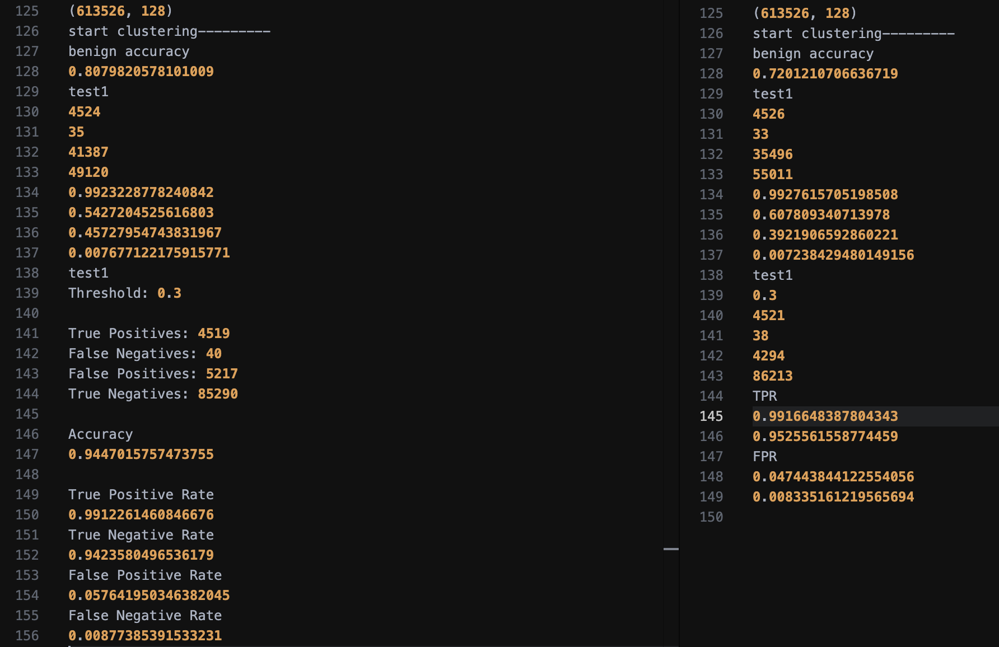
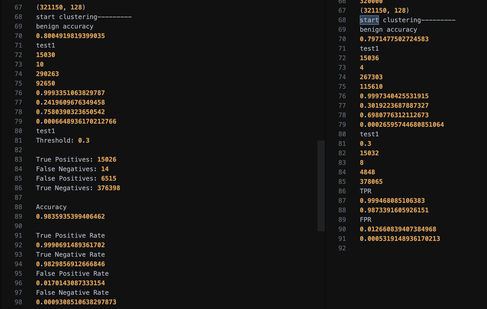
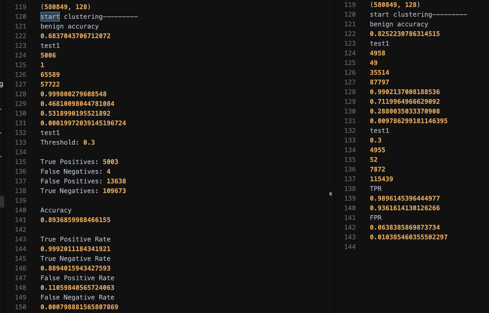
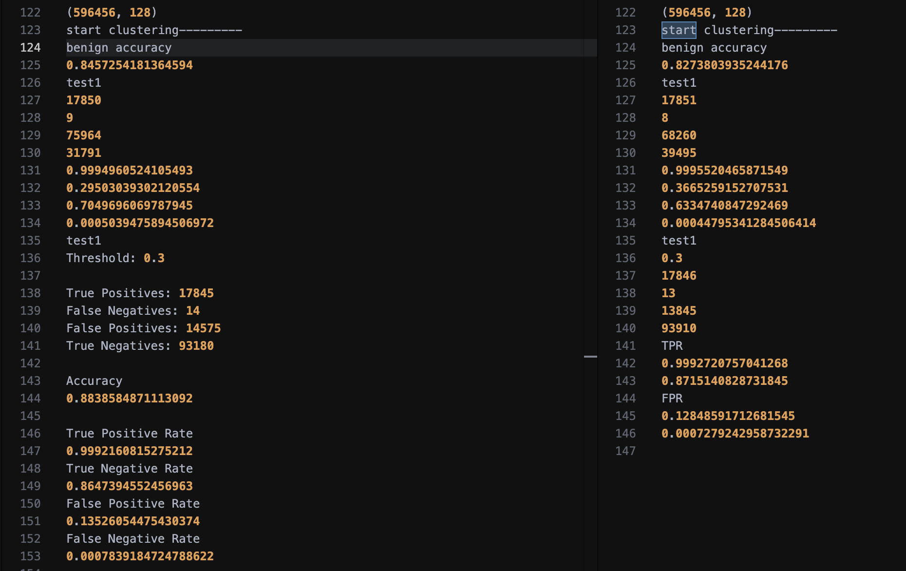

## **AirTag**

Main repository: https://github.com/amaana259/Airtag/tree/main

## **Steps**

- Fork repository (link provided on the Provenance Github repo).
- Go through the directories.
- Preprocess provided datasets.
- Train model on the pre-processed datasets, produce embeddings.
- Test the model on the provided test datasets.
- Verify results.

---

## **Benefits and Issues Faced**:

- The repository has a well-defined code structure and has separate code files for each sub-process of the tool. These are coded in Python files so I was able to verify that each component mentioned in the paper is in fact present in the code files as well.

- The paper mentioned use of the BERT model which is also consistent with the code. The training data is pre-processed to create embedding vectors and then used to train the model, as defined in the paper.

- The training datasets are very large in size (around 12 GB) and had to be downloaded from a separate Google Drive. I had trouble storing these datasets on my personal device but given compute resources are available, I will be able to implement the manual pre-processing, training and testing runs.

--------

- Libraries for environment required were outdated. Dependencies difficult to install as no support exists.

- Specific environment required which was difficult to achieve without proper permissions on compute host.

- SDatasets worked well, but OCSVM on the MDatasets got stuck after a few hours with no progress. A lot of time spent on seeing what the issue with MDataset runs was, halted UDataset runs.

- UDatasets still to be tested.

- No code for graph/attack sequence production.

- No code for anomaly detection mentioned in the paper.

- Code inconsistency for MDataset results.

---

## **How much was run?**

- The entire code was run, except for the final 3 commands in the bash script which got stuck, (for MDatasets).

- All datasets pre-processed, pre-trained, embeddings created, models made and saved, and test set embeddings created.

- OneSVM models run for SDatasets on benign and test data, stuck for MDatasets, possibly due to much larger size?

---

## **Environment Setup**

- Much of the time put into making sure the environments were consistent.

- Repo README stated requirements: Python 3.6, Numpy 1.19.5 and TensorFlow 1.11.0

- Working on remote host with no sudo permissions, I had to first install the old version of Python manually using curl and sourcebash updates.

- Then start a virtual environment that had the new Python. Here after installing pip, every pip command resulted in segmentation faults (core dumped). I managed to fix this using a patch and update to the pip file.

- The Docker image for tensorflow 1.11 was only compatible with Python 3.5, which in turn was not compatible with any numpy versions later than 1.18. As for the tensorflow 1.11.0, installation through pip was not possible since support for this version had been stopped.

- I manually installed the tensorflow version through tarballs, but ran into dependency issues. Specifically, the library 'termcolor' was not installing through pip. I had to again find a tarball for this and manually install it, after which I got tensorflow 1.11 working.

- After starting up the virtual environment with the correct conditions, I updated the effect.sh script to work with only one GPU (Tesla GPU available to me) and ran the script. I also modified the working directory structure with my own structure.

## **Results**

<!--  -->

- **S1 Log Results**:

Minor discrepencies within the results.

---

- **S2 Log Results**:

Minor discrepencies within the results.

---

- **S3 Log Results**:

Minor discrepencies within the results. TPR higher in my run.

---

- **S4 Log Results**:

Minor discrepencies within the results.

---

## **Code Quality**

- **Code structure**: Well-defined, separate files are made for each sub-process of the tool.

- **Readability**: Easy-to-read.

- **Commenting and documentation**: Well-documented and code is commented.

- **Optimization**: After manual runs, I can look to optimise the Python code, one example of passing a code snippet to GPT did optimise and lower the running time of the snippet.

- **Adherence to best practices**: Yes.

---

## **Conclusion**

- **Main takeaways:**

    None.

- **Final thoughts or recommendations:**

    None.

- **Next steps for improvement:**

    See why MDataset runs are getting stuck. Verify the results for UDatasets.

